<div align="center">


# MediConnect

**Gestión de citas médicas que conecta pacientes, médicos y administradores.**

[](https://cabrales16.github.io/MediConnect/)


</div>

---

## ✨ ¿Qué es MediConnect?

Una plataforma web para **agendar y gestionar citas médicas** en un solo lugar. Reduce los tiempos de espera y mejora el acceso a la información clínica con una arquitectura REST: **React** en el frontend y **FastAPI** en el backend.

> 🎮 **Pruébala sin instalar nada:** la [demo en vivo](https://cabrales16.github.io/MediConnect/) incluye datos de ejemplo y las tres vistas (paciente, médico y administrador).

## 🖼️ Galería

<table>
  <tr>
    <td align="center">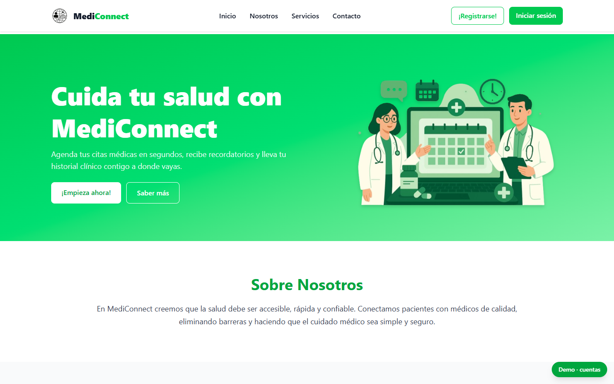<br/><sub><b>🏠 Página de inicio</b></sub></td>
    <td align="center">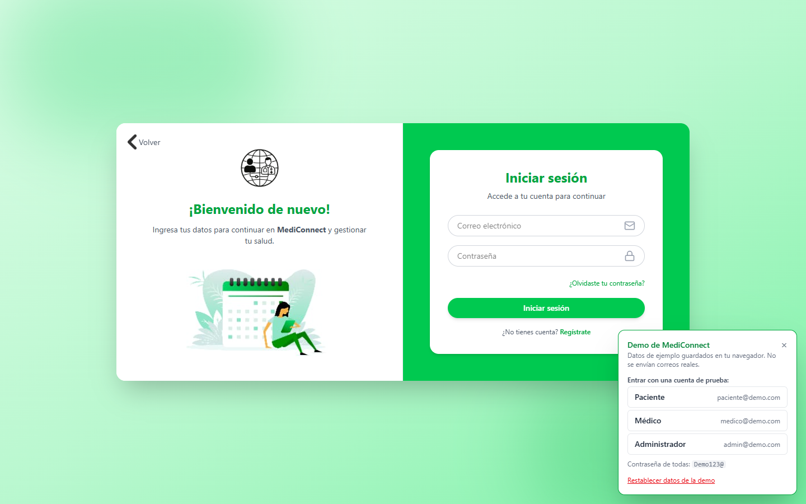<br/><sub><b>🔐 Inicio de sesión</b></sub></td>
  </tr>
</table>

### 🧑‍🤝‍🧑 Paciente

<table>
  <tr>
    <td align="center"><br/><sub><b>📰 Novedades y bienvenida</b></sub></td>
    <td align="center">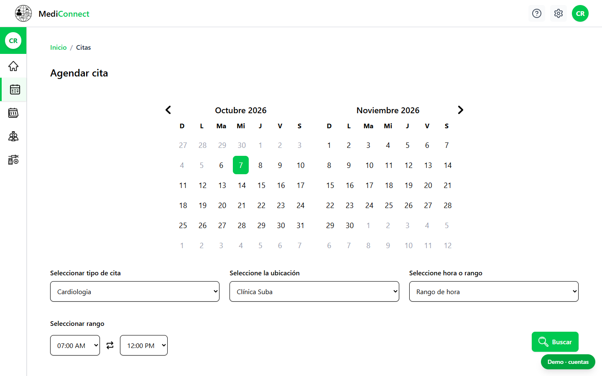<br/><sub><b>📅 Agendar cita</b></sub></td>
  </tr>
  <tr>
    <td align="center">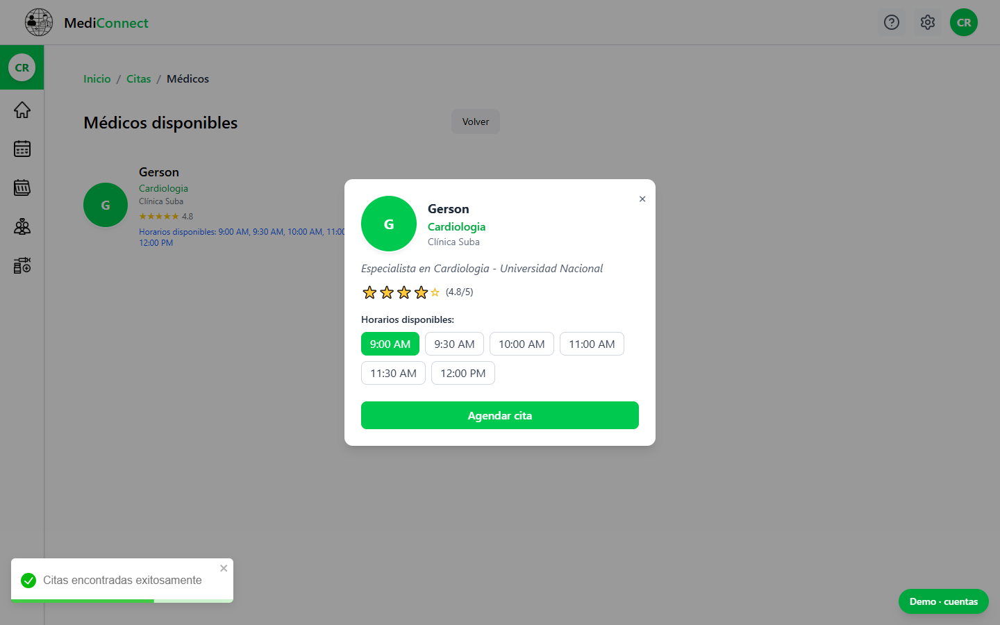<br/><sub><b>👨‍⚕️ Médicos disponibles</b></sub></td>
    <td align="center">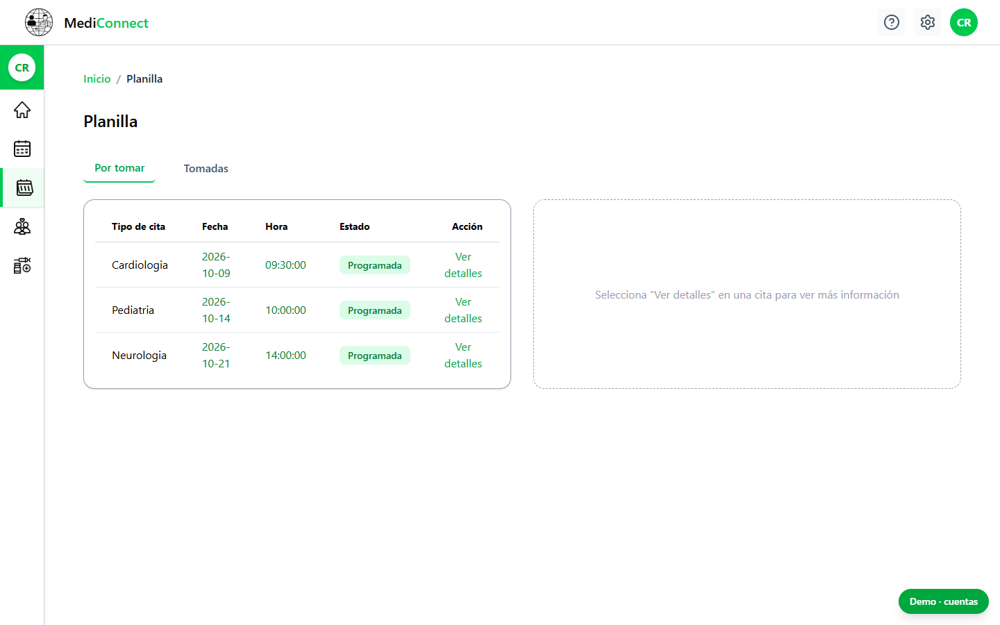<br/><sub><b>📋 Planilla de citas</b></sub></td>
  </tr>
  <tr>
    <td align="center">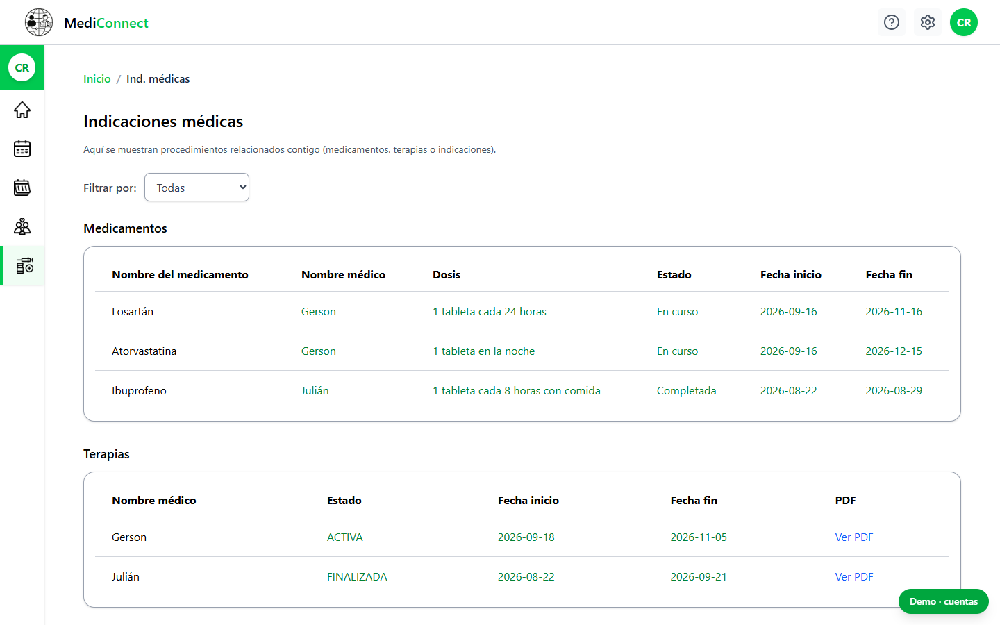<br/><sub><b>💊 Indicaciones médicas</b></sub></td>
    <td align="center">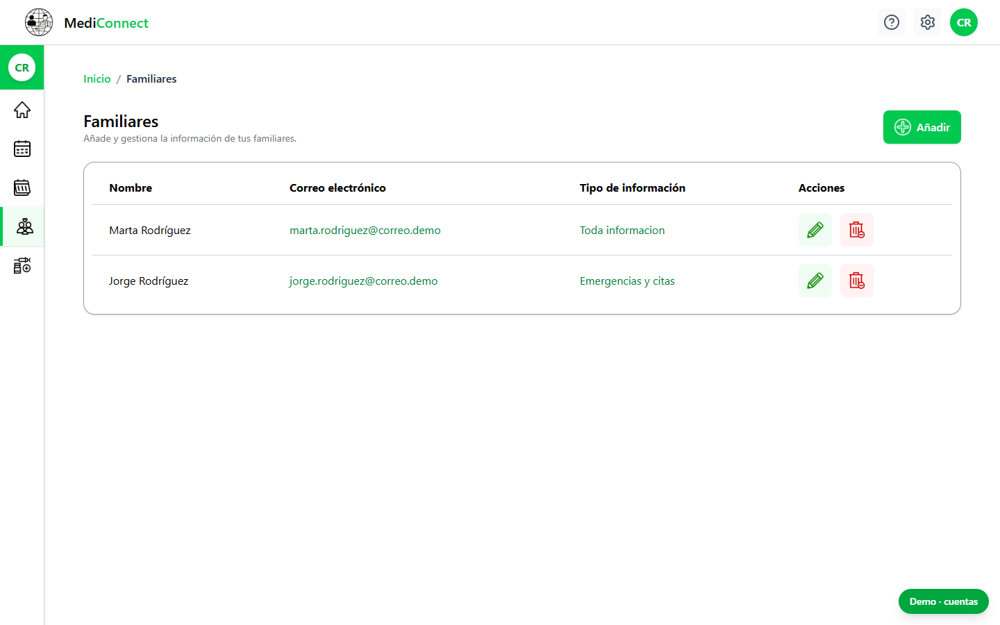<br/><sub><b>👪 Familiares</b></sub></td>
  </tr>
</table>

### 🩺 Médico y 🛠️ Administrador

<table>
  <tr>
    <td align="center">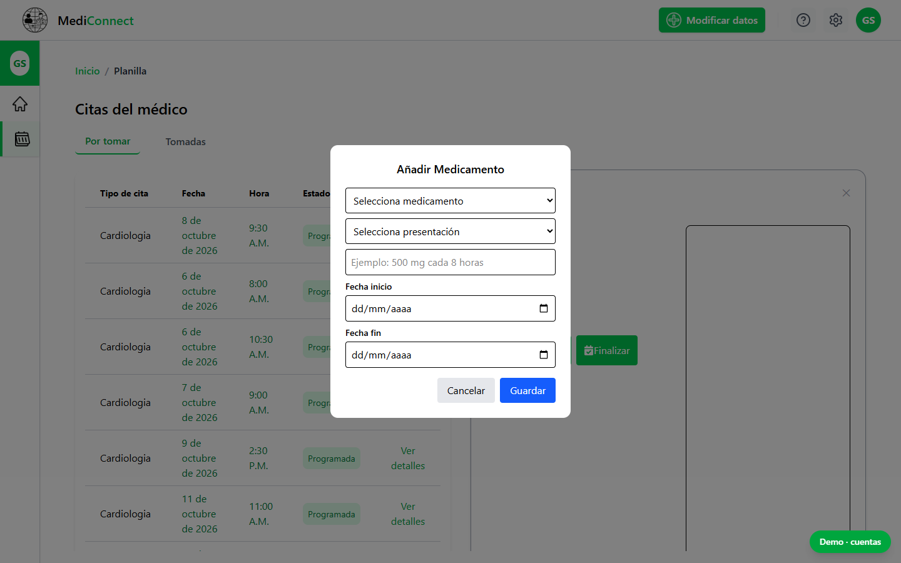<br/><sub><b>🩺 Atención de citas y medicación</b></sub></td>
    <td align="center">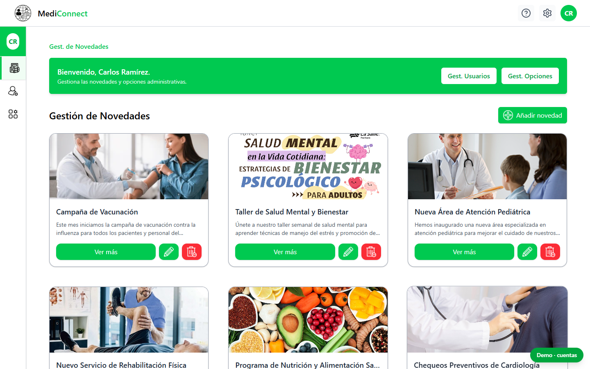<br/><sub><b>📣 Gestión de novedades</b></sub></td>
  </tr>
  <tr>
    <td align="center">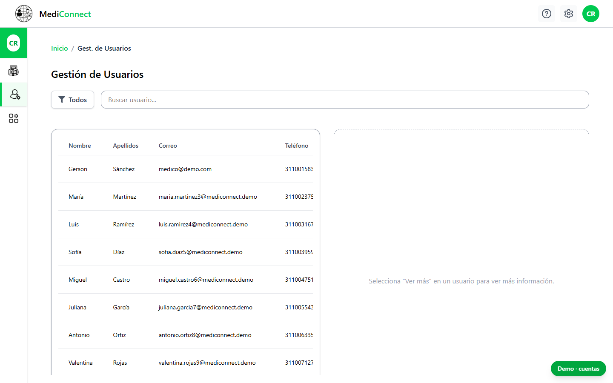<br/><sub><b>👥 Gestión de usuarios</b></sub></td>
    <td align="center">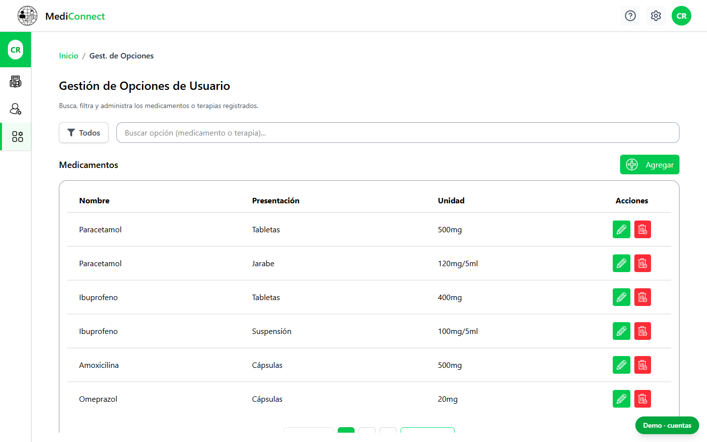<br/><sub><b>⚙️ Medicamentos y terapias</b></sub></td>
  </tr>
</table>

## 🧩 Funcionalidades

| Rol | Qué puede hacer |
|---|---|
| 🧑 **Paciente** | Agendar, consultar y cancelar citas por especialidad, fecha, hora y hospital · ver su historial · gestionar familiares que reciben notificaciones · consultar medicación, terapias (PDF) e indicaciones |
| 🩺 **Médico** | Ver su planilla de citas · recetar medicamentos · asignar terapias · registrar indicaciones · finalizar citas |
| 🛠️ **Administrador** | Publicar novedades con imagen · administrar usuarios (cambiar rol, editar datos, suspender) · mantener el catálogo de medicamentos y terapias |
| 🔐 **Todos** | Registro con confirmación por correo · recuperación de contraseña · bloqueo tras 3 intentos fallidos · acceso por roles · reporte de errores y centro de ayuda |

## 🏗️ Arquitectura

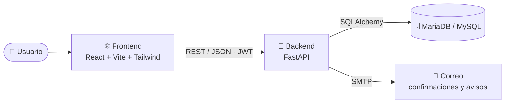

## 🛠️ Stack tecnológico

<div align="center">


</div>

| Capa | Tecnologías |
|---|---|
| **Frontend** | React 18, Vite, Tailwind CSS, React Router, Axios, Framer Motion, React-Toastify, Lucide |
| **Backend** | Python, FastAPI, SQLAlchemy, Alembic, Pydantic, JWT, bcrypt |
| **Base de datos** | MariaDB / MySQL |
| **DevOps** | Git y GitHub, GitHub Actions (CI/CD), GitHub Pages |

## 📂 Estructura del proyecto

```text
MediConnect/
├── 🐍 backend/          API REST (FastAPI)
├── ⚛️ frontend/         Aplicación React
│   └── src/mock/        API simulada para la demo
├── 🗄️ Base_de_Datos/    Modelos, migraciones (Alembic) y datos semilla
├── 📚 docs/             Documentación y capturas
├── 📜 Guia_EstandaresCodigo.md
└── 🔀 Git_Workflow.md
```

## 🎮 Demo en GitHub Pages

La demo corre **sin backend**: con `VITE_DEMO_MODE=true`, las peticiones de Axios las responde una API simulada en el navegador ([`frontend/src/mock/`](frontend/src/mock)). Replica los endpoints del FastAPI con la misma forma de respuesta, y los cambios se guardan en `localStorage`.

**Cuentas de prueba** (contraseña `Demo123@`):

| Rol | Correo |
|---|---|
| 🧑 Paciente | `paciente@demo.com` |
| 🩺 Médico | `medico@demo.com` |
| 🛠️ Administrador | `admin@demo.com` |

> 💡 El botón verde **“Demo · cuentas”** (abajo a la derecha) permite entrar con un clic y restablecer los datos. No se envían correos reales: los avisos se muestran en pantalla.

## ⚙️ Instalación local

**Requisitos:** Node.js 20+, Python 3.11+, Git y MariaDB/MySQL (solo para el backend real).

<details>
<summary><b>🐍 Backend (FastAPI)</b></summary>

```bash
cd backend
pip install -r requirements.txt
uvicorn main:app --reload
```
</details>

<details open>
<summary><b>⚛️ Frontend con backend real</b></summary>

```bash
cd frontend
npm install
npm run dev
```
</details>

<details open>
<summary><b>🎮 Frontend en modo demo (sin backend)</b></summary>

```bash
cd frontend
npm install
npm run build:demo
npm run preview:demo   # http://localhost:4173/MediConnect/
```
</details>

## 🔐 Seguridad

- 🔑 Contraseñas cifradas (bcrypt) y autenticación JWT
- 🛡️ Control de acceso por roles en cada ruta
- ⏱️ Bloqueo temporal tras intentos fallidos y manejo de inactividad
- 🧼 Sanitización de datos de entrada

## 📋 Metodología

Desarrollo ágil con **SCRUM**: sprints, backlog, reuniones diarias y retrospectivas, con seguimiento en Jira. Consulta la [guía de estándares de código](Guia_EstandaresCodigo.md) y el [flujo de trabajo con Git](Git_Workflow.md).

## 👨‍💻 Equipo de desarrollo

| | |
|---|---|
| 👤 **Andrés Cabrales Baena** | [@Cabrales16](https://github.com/Cabrales16) |
| 👤 **Sofía Segura Guacare** | |
| 👤 **Gerson Samuel Sánchez García** | |
| 👤 **Juliana García Pérez** | |

<div align="center">

🎓 **SENA** · Centro de Gestión de Mercados, Logística y Tecnologías de la Información
📍 Bogotá, Colombia

</div>
